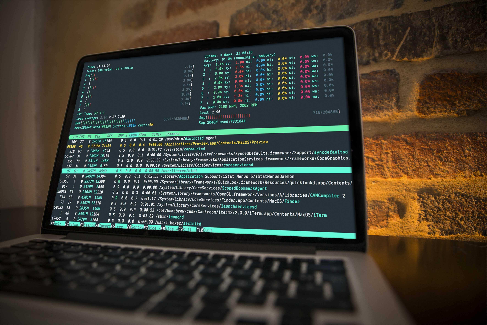
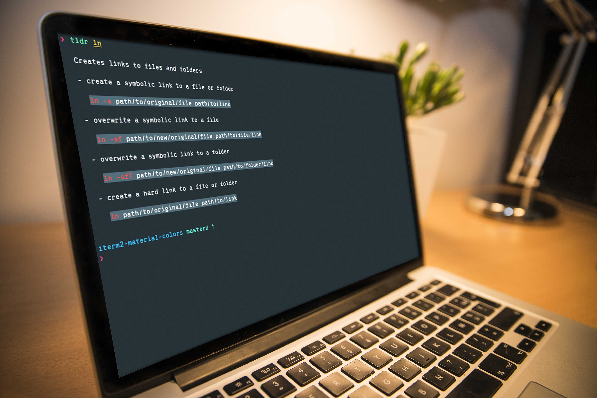
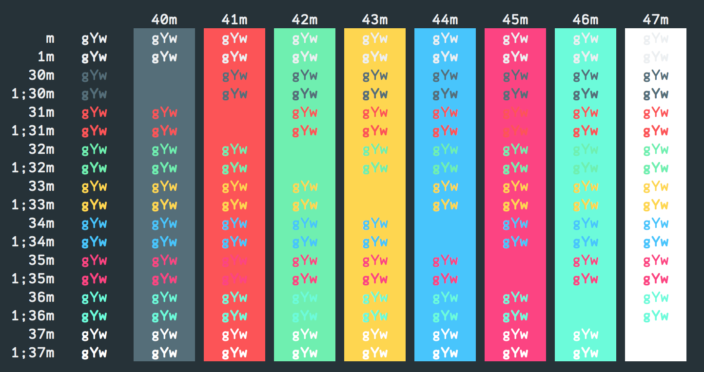

# iTerm2 Material Design

This is an iTerm2 color scheme based on [Google's Material Design Color Palette](http://www.google.com/design/spec/style/color.html).

## How to use it

1. Clone the repo or [download the file `material-design-colors.itermcolors`](https://raw.githubusercontent.com/MartinSeeler/iterm2-material-design/master/material-design-colors.itermcolors)
2. *iTerm2 > Preferences > Profiles > Colors Tab*
3. Click *Color Presets...*
4. Click *Import...*
5. Select the `material-design-colors.itermcolors` file
5. Select the *material-design-colors* from *Load Presets...*

If you wish to use these colors for custom terminals / projects, please use the colors from [colors.md](colors.md).

## Donate

If you wish to donate to the project, please send ETH or ERC20 tokens to [0xA5F0F9a2689da26B2debcC17F3991b3f52711366](https://etherscan.io/address/0xA5F0F9a2689da26B2debcC17F3991b3f52711366)

## Setup from Screenshots
- Wallpaper: [softe wallpaper by jivebs](http://jivebs.deviantart.com/art/softe-wallpaper-392758319)
- ZSH-Prompt: [Pure prompt](https://github.com/sindresorhus/pure) by [Sindre Sorhus](https://github.com/sindresorhus)
- Font: [Range Mono](https://pilgrimfonts.com/range-mono/) by [Griffin Moore](http://griffinmoore.com/)

