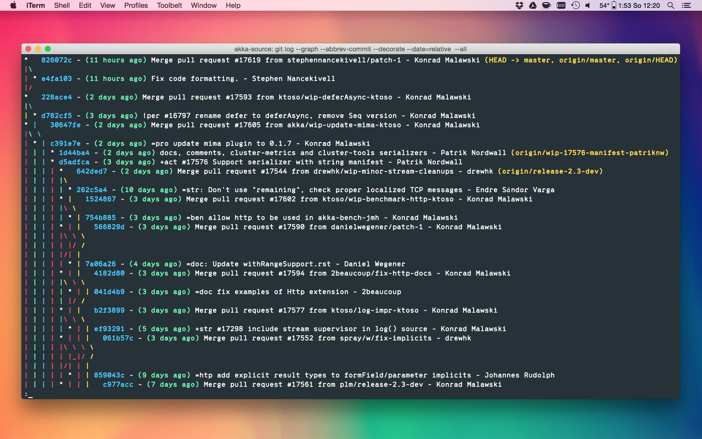
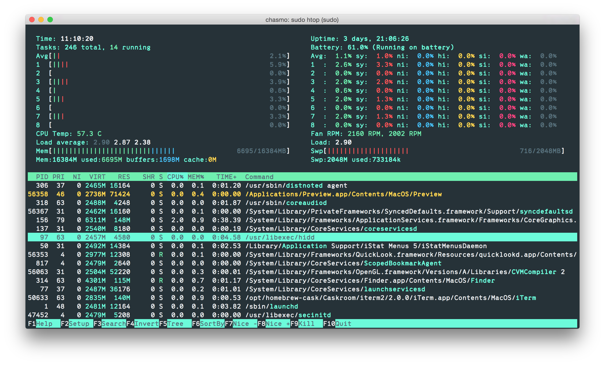
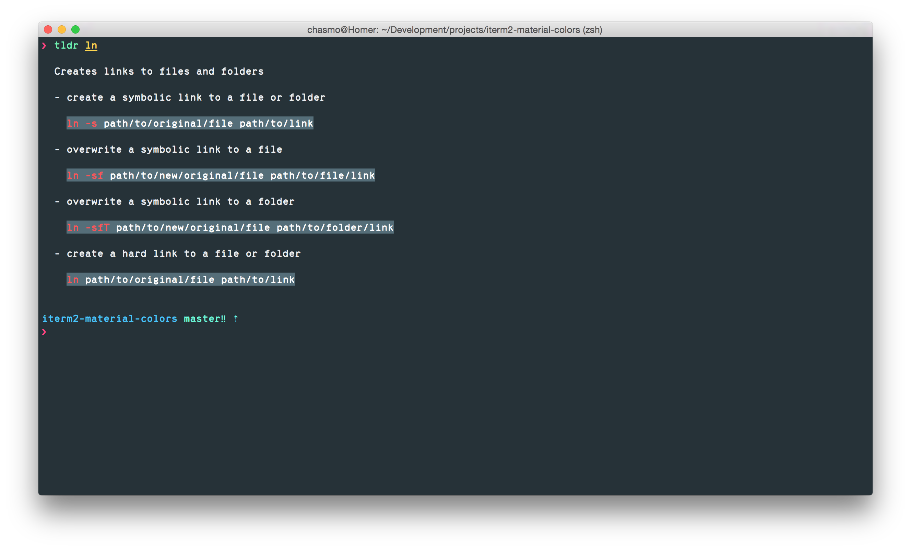

# iTerm2 Material Design

This is an iTerm2 color scheme based on [Google's Material Design Color Palette](http://www.google.com/design/spec/style/color.html).

## How does it look like?

## How to use it

1. Clone the repo or download the file `material-design-colors.itermcolors`
2. *iTerm2 > Preferences > Profiles > Colors Tab*
3. Click *Load Presets...*
4. Click *Import...*
5. Select the `material-design-colors.itermcolors` file
5. Select the *material-design-colors* from *Load Presets...*